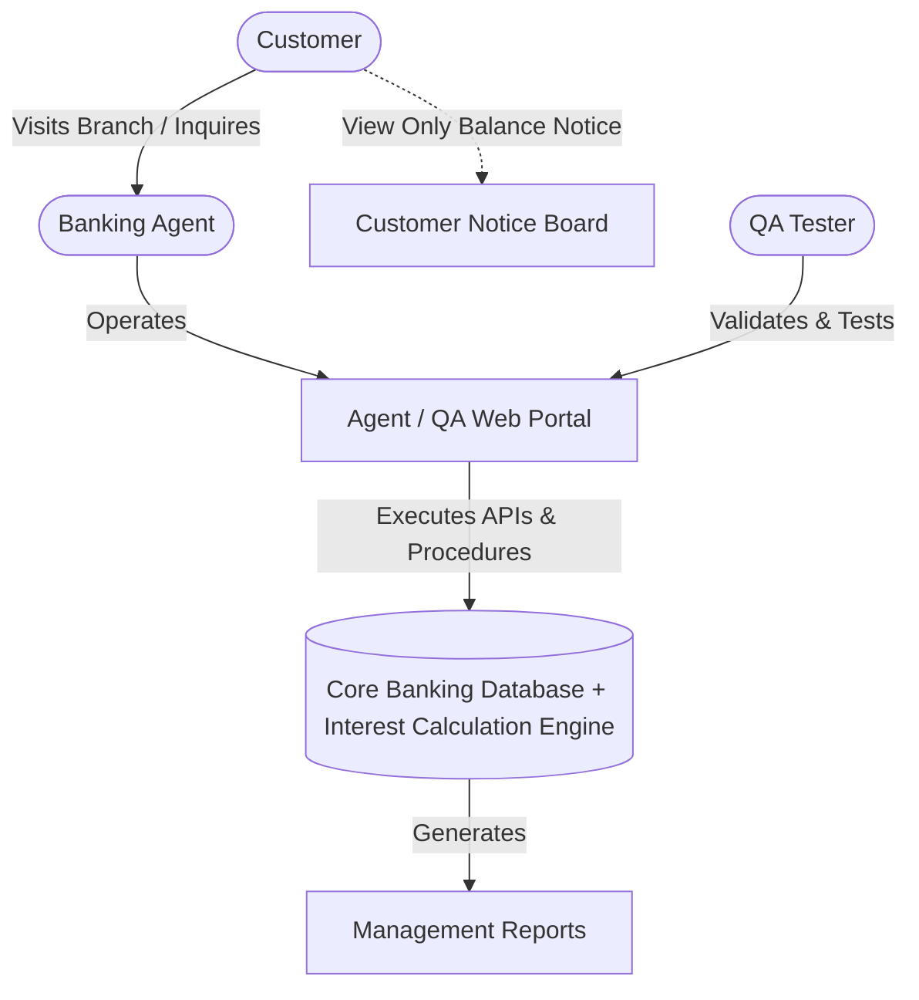
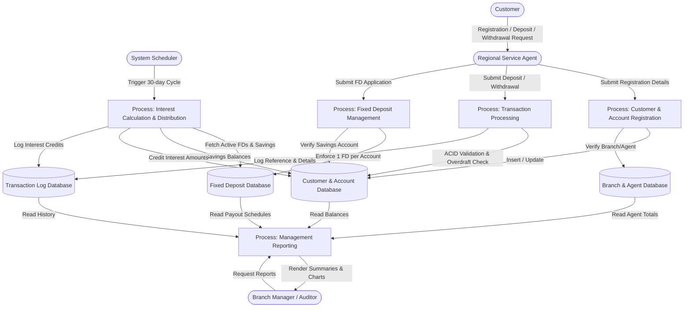
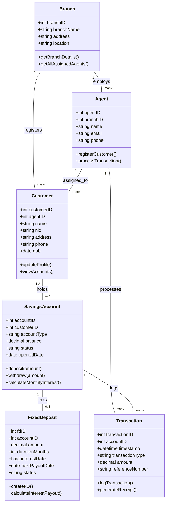
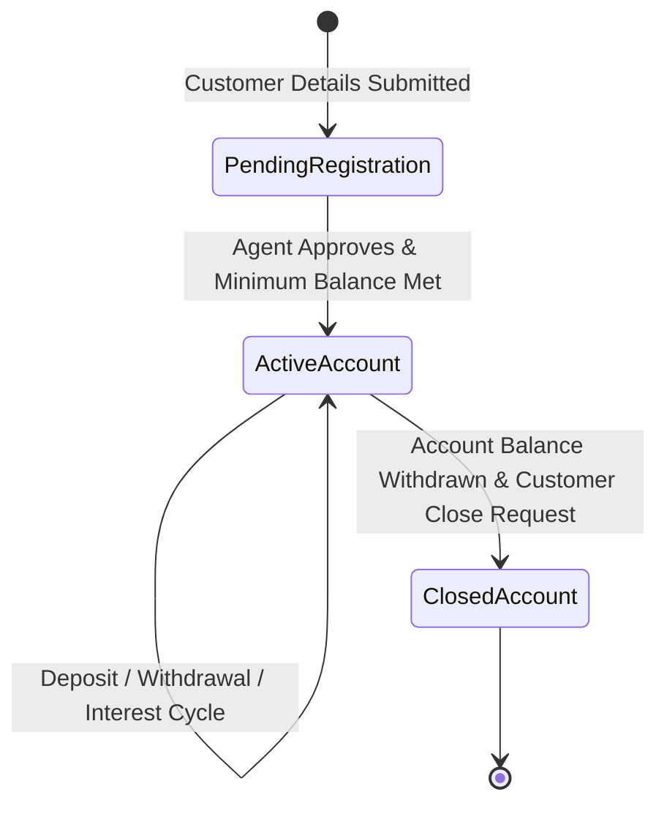
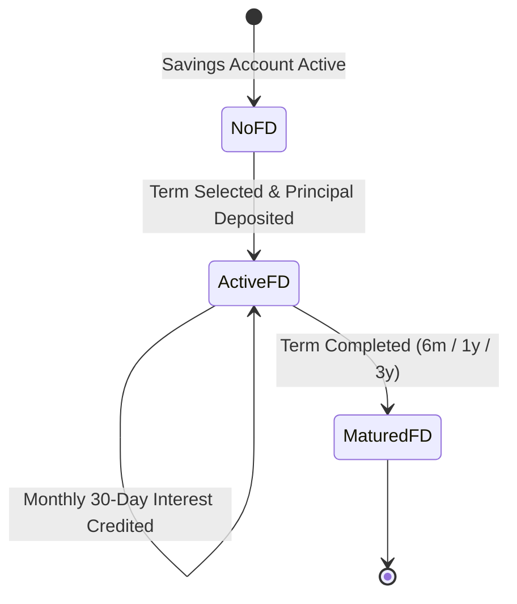

# Software Requirements Specification (SRS)
## for Microbanking and Interest Management System (MIMS)

**Version 1.0 approved**  
**Course:** CS 3043 Database Systems  
**Date:** 27.07.2026  

### Prepared by Group 31
| Student Index | Student Name |
| :--- | :--- |
| **240351P** | Kodithuwakku K.A.N.N |
| **240589C** | Sandamini M.M.R |
| **240294R** | Jayawardana Y.G.L.S |
| **240118J** | Dhananjaya P.D.L.K |
| **240741L** | Yasarathna G.L.R.S |

---

## Table of Contents
1. [Introduction](#1-introduction)
   - [1.1 Purpose](#11-purpose)
   - [1.2 Document Conventions](#12-document-conventions)
   - [1.3 Intended Audience and Reading Suggestions](#13-intended-audience-and-reading-suggestions)
   - [1.4 Product Scope](#14-product-scope)
   - [1.5 References](#15-references)
2. [Overall Description](#2-overall-description)
   - [2.1 Product Perspective](#21-product-perspective)
   - [2.2 Product Functions](#22-product-functions)
   - [2.3 User Classes and Characteristics](#23-user-classes-and-characteristics)
   - [2.4 Operating Environment](#24-operating-environment)
   - [2.5 Design and Implementation Constraints](#25-design-and-implementation-constraints)
   - [2.6 User Documentation](#26-user-documentation)
   - [2.7 Assumptions and Dependencies](#27-assumptions-and-dependencies)
3. [External Interface Requirements](#3-external-interface-requirements)
   - [3.1 User Interfaces](#31-user-interfaces)
     - [3.1.1 GUI Standards and Product design System](#311-gui-standards-and-product-design-system)
     - [3.1.2 Standard Buttons, Controls and Feedback Display](#312-standard-buttons-controls-and-feedback-display)
     - [3.1.3 Software Components Requiring User Interfaces](#313-software-components-requiring-user-interfaces)
   - [3.2 Hardware Interfaces](#32-hardware-interfaces)
     - [3.2.1 Server Hardware Interfaces](#321-server-hardware-interfaces)
     - [3.2.2 Client Hardware Interfaces](#322-client-hardware-interfaces)
   - [3.3 Software Interfaces](#33-software-interfaces)
     - [3.3.1 Database Management System Interface (MySQL 8.0)](#331-database-management-system-interface-mysql-80)
     - [3.3.2 Operating System and Runtime Interfaces](#332-operating-system-and-runtime-interfaces)
     - [3.3.3 Shared Data & Communication Interfaces](#333-shared-data--communication-interfaces)
   - [3.4 Communications Interfaces](#34-communications-interfaces)
     - [3.4.1 Client-Server Communication Protocol](#341-client-server-communication-protocol)
     - [3.4.2 Database Network Protocol](#342-database-network-protocol)
     - [3.4.3 Security, Encryption & Access Control](#343-security-encryption--access-control)
4. [System Features](#4-system-features)
   - [4.1 Customer and Savings Account Registration](#41-customer-and-savings-account-registration)
   - [4.2 Transaction Processing (Deposits & Withdrawals)](#42-transaction-processing-deposits--withdrawals)
   - [4.3 Fixed Deposit Management](#43-fixed-deposit-management)
   - [4.4 Automated Monthly Interest Calculation](#44-automated-monthly-interest-calculation)
5. [Other Nonfunctional Requirements](#5-other-nonfunctional-requirements)
   - [5.1 Performance Requirements](#51-performance-requirements)
   - [5.2 Safety Requirements](#52-safety-requirements)
   - [5.3 Security Requirements](#53-security-requirements)
   - [5.4 Software Quality Attributes](#54-software-quality-attributes)
   - [5.5 Business Rules](#55-business-rules)
6. [Other Requirements](#6-other-requirements)
- [Appendix A: Glossary](#appendix-a-glossary)
- [Appendix B: Analysis Models](#appendix-b-analysis-models)
- [Appendix C: To Be Determined List](#appendix-c-to-be-determined-list)

---

## Revision History
| Name | Date | Reason For Changes | Version |
| :--- | :--- | :--- | :--- |
| Group 31 | 27.07.2026 | Initial baseline SRS approval | 1.0 |

---

## 1. Introduction

### 1.1 Purpose
This SRS defines the functional and non-functional requirements for the **Microbanking and Interest Management System (MIMS)**, developed for **B-Trust**, a microfinance bank in Sri Lanka. It covers the backend database design and the lightweight QA web interface used to manage customer registration, savings accounts, deposits/withdrawals, fixed deposits, and automated monthly interest calculation. Future channels such as mobile banking, SMS/USSD, or payment gateway integrations are out of scope.

### 1.2 Document Conventions
- Database object names follow standard naming prefixes:
  - `sp_` for stored procedures
  - `fn_` for stored functions
  - `trg_` for database triggers
- All monetary values are expressed in **Sri Lankan Rupees (LKR)** unless otherwise stated.
- Priority levels (High, Medium, Low) assigned to each System Feature are inherited by all functional requirements listed beneath it, unless a requirement explicitly states its own priority.

### 1.3 Intended Audience and Reading Suggestions
- **Development Team / Database Engineers:** To design and implement the schema, stored procedures, functions, and triggers described in Sections 3 and 4.
- **QA Testers:** To understand expected system behavior, validation rules, and error conditions for test case design, primarily using Sections 4 and 5.
- **Branch Managers and Banking Agents (future end users):** To understand the operational workflows the system supports.
- **Reading suggestions:** Readers are advised to begin with Section 2 (Overall Description) for a high-level understanding of the system, then proceed to Section 3 (External Interface Requirements) for interface and technical stack details, followed by Section 4 (System Features) for detailed functional behavior, and Section 5 (Other Nonfunctional Requirements) for performance, security, and quality constraints.

### 1.4 Product Scope
- MIMS is a backend-driven microbanking database system built to digitize B-Trust's core operations.
- Core operations covered: customer and savings account registration, deposit/withdrawal transaction processing, fixed deposit management, and automated monthly interest distribution.
- Supports five savings plans: **Children, Teen, Adult, Senior, Joint**.
- Supports three fixed deposit tenures: **6 months, 1 year, 3 years**.
- Supports B-Trust's goal of improving financial inclusion for rural communities by enabling regional service agents to manage customer accounts efficiently and accurately.
- Enforces strict data integrity, overdraft prevention, and ACID-compliant transaction processing.
- Includes a lightweight web-based QA console for testers/administrators to validate operations and generate the five mandatory management reports, without needing a full production-grade front end.

### 1.5 References
I. IEEE Std 830-1998, *IEEE Recommended Practice for Software Requirements Specifications*, IEEE Computer Society.  
II. ISO/IEC/IEEE 29148:2018, *Systems and software engineering — Life cycle processes — Requirements engineering* (Superseded IEEE Std 830).  
III. *Personal Data Protection Act, No. 9 of 2022*, Parliament of the Democratic Socialist Republic of Sri Lanka.  
IV. *MySQL 8.0 Reference Manual*, Oracle Corporation (Stored Procedures, Triggers, and InnoDB Transaction Model).  
V. *Node.js mysql2 Database Client Library*, GitHub Community.  
VI. Central Bank of Sri Lanka (CBSL), *Microfinance Act, No. 6 of 2016 & Operational Guidelines for Microfinance Institutions*.  
VII. *Lucidchart Diagramming & Flowchart Software*, Lucid Software Inc. (used for context, DFD, and class diagrams).  
VIII. *Mermaid Live Editor*, Mermaid.js Community (used for state-transition diagrams and ER database modeling).  

---

## 2. Overall Description

### 2.1 Product Perspective
The Microbanking and Interest Management System (MIMS) is a new, self-contained backend database system, together with a lightweight validation UI, commissioned by B-Trust, a small private microfinance bank operating across several districts in Sri Lanka. MIMS is not a follow-on to an existing automated system, it replaces what is currently a manual, paper-based process for registering customers, tracking Savings Accounts and Fixed Deposits, and calculating interest. MIMS is not a component of any larger corporate system and has no dependency on an external database or third-party service.

Because most B-Trust customers live in rural districts with limited direct access to computing devices, the **Customer** does not connect to the system directly; instead, a **Banking Agent** at a regional Branch performs registration, deposits, withdrawals, and Fixed Deposit transactions on the Customer's behalf, and the Customer may view a read-only balance notice through the Agent. The **QA Tester** connects to a lightweight web interface that talks directly to the backend database in order to validate core operations, stored procedures, functions, and triggers. The **Interest Calculation Engine** is not a human actor but an automated, scheduled process inside the system that calculates and posts interest on a 30-day cycle without requiring direct human interaction.

B-Trust operates a small number of service Branches, each of which manages a team of Banking Agents. Every Customer registers at a Branch and is assigned to a specific Agent, who remains the Customer's primary point of contact for all subsequent transactions.

### 2.2 Product Functions
The major functions MIMS must perform, or must let an Agent perform on a Customer's behalf:
- **Customer and Agent Registration:** Register Customers at a Branch and assign each Customer to a responsible Agent.
- **Savings Account Management:** Open and maintain Savings Accounts for individual, minor, senior, or joint Customers under one of five Account Plans.
- **Deposit and Withdrawal Processing:** Record deposits and withdrawals during business hours, enforcing minimum-balance and no-overdraft rules.
- **Fixed Deposit Management:** Open a Fixed Deposit linked to an eligible Savings Account under one of three Terms, limited to one active Fixed Deposit per Savings Account.
- **Automated Interest Calculation and Crediting:** Calculate and post Fixed Deposit interest to the linked Savings Account on a recurring 30-day cycle, without manual intervention.
- **Transaction Logging:** Log every deposit, withdrawal, and interest credit with a timestamp, transaction type, and a system-generated reference number.
- **Management Reporting:** Produce agent-wise transaction totals, account-wise summaries, active-FD listings, monthly interest distribution, and customer activity reports.
- **Database Validation Interface:** Provide a lightweight UI through which a QA Tester can directly exercise and verify the underlying stored procedures, functions, and triggers.

#### Savings Plan Product Rules
| Savings Plan | Interest Rate | Minimum Balance | Eligibility |
| :--- | :---: | :---: | :--- |
| **Children** | 12% | None | Customer under 13 years |
| **Teen** | 11% | LKR 500 | Customer 13–17 years |
| **Adult** | 10% | LKR 1,000 | Customer 18–59 years |
| **Senior** | 13% | LKR 1,000 | Customer 60 years and above |
| **Joint** | 7% | LKR 5,000 | Two or more account holders |

#### Fixed Deposit Product Rules
| Fixed Deposit Term | Term Interest Rate | Interest Posting |
| :--- | :---: | :--- |
| **6 months** | 13% | Monthly, to linked Savings Account |
| **1 year** | 14% | Monthly, to linked Savings Account |
| **3 years** | 15% | Monthly, to linked Savings Account |

A Customer may hold only **one active Fixed Deposit per Savings Account**, and every Fixed Deposit must be linked to an active Savings Account belonging to the same Customer. Each monthly interest credit, and every deposit or withdrawal, is recorded as an individually logged transaction.

### 2.3 User Classes and Characteristics
| User Class | Frequency of Use | Technical Profile | Privilege Level |
| :--- | :--- | :--- | :--- |
| **Customer** | Occasional (via Agent) | None assumed; not expected to interact with the system directly. | None — read-only balance notice communicated through the Agent. |
| **Banking Agent** | Daily, primary user | Comfortable with standard web browser, forms, and grids; no database/programming background required. | Register Customers; open/manage Savings Accounts and Fixed Deposits; process deposits and withdrawals; generate reports for assigned Customers. |
| **Branch Manager** | Daily to weekly | Same as Banking Agent. | Same as Banking Agent, plus reports summarising activity across an entire Branch. |
| **QA Tester** | During test cycles only | Technically proficient; familiar with relational database concepts (keys, transactions, constraints); no microfinance domain expertise required. | Access limited to test interface; may exercise stored procedures, functions, and triggers but must not bypass data-integrity constraints. |
| **Interest Calculation Engine** *(system actor)* | Automated, every 30-day cycle | Not applicable — automated backend process. | System-level; no human privilege boundary. |

### 2.4 Operating Environment
The Core Banking Database and Interest Calculation Engine are hosted on a relational database management system (RDBMS) capable of enforcing primary/foreign key constraints, stored procedures, functions, and triggers (MySQL 8.0 InnoDB), running on server hardware provided by B-Trust. The Agent Portal and QA Tester's validation UI are accessed via a standard modern web browser over a stable internet/intranet connection.

### 2.5 Design and Implementation Constraints
| Constraint | Description |
| :--- | :--- |
| **Data Integrity (ACID)** | Every deposit, withdrawal, Fixed Deposit opening, and interest credit must be processed as an atomic, consistent, isolated, and durable transaction, implemented through stored procedures and triggers rather than relying solely on application-level checks. |
| **No Overdrafts** | Withdrawals that would reduce a Savings Account below its Plan's minimum balance, or below zero, must be rejected by the database layer itself. |
| **Referential Integrity** | Primary and foreign keys must enforce the relationships between Branches, Agents, Customers, Savings Accounts, Fixed Deposits, and Transactions, including the rule that a Savings Account may be linked to at most one active Fixed Deposit. |
| **Performance / Indexing** | Indexes must be created on frequently queried columns, including Account Number, Customer ID, Agent ID, and Transaction Date, to keep report generation and balance lookups responsive as transaction volume grows. |
| **Security** | A QA Tester's access is limited to the test interface and must not be able to bypass the constraints and triggers that protect production data. |
| **Currency and Locale** | All monetary values are recorded and processed in Sri Lankan Rupees (LKR); no multi-currency support is required. |
| **Sample Data Volume** | The initial database must be populated with at least 5 Agents, 3 Branches, 15 Customers (including at least 2 Joint Accounts), 10 Fixed Deposits, and 100 transactions, to support QA validation. |

### 2.6 User Documentation
- Database design document describing the entity-relationship model, table definitions, and stored procedures, functions, and triggers.
- A short QA Tester's guide describing how to use the lightweight validation UI to exercise each database operation.
- An annotated sample data set (Agents, Branches, Customers, Fixed Deposits, and Transactions) for testing and reference.
- In-app guidance provided to Agents within the Agent Portal itself.

### 2.7 Assumptions and Dependencies
- **Business hours:** Deposits and withdrawals may be processed approximately 9:00 AM to 5:00 PM, Monday to Friday. Configurable.
- **30-day interest cycle:** 30 days is assumed for every interest-calculation cycle, regardless of calendar month length.
- **No arbitrary withdrawal limit:** MIMS assumes no fixed per-transaction or per-day ceiling beyond minimum balance and overdraft prevention rules.
- **Standalone architecture:** No external credit bureau or external membership system dependencies.
- **RDBMS capabilities:** Database supports ACID transactions, stored procedures, functions, and triggers.
- **Adult supervision:** Children and Teen accounts are assumed adult-supervised; guardianship is confirmed by the Agent at registration.
- **Locale:** Bank operates strictly within Sri Lanka in LKR.

---

## 3. External Interface Requirements

### 3.1 User Interfaces
The system provides a responsive, single-page Web User Interface (SPA) tailored for operational management, QA testing, and technical demonstrations.

#### 3.1.1 GUI Standards and Product Design System
- **Color Palette & Visual Hierarchy:**
  - *Primary Accent Color:* Warm Golden Yellow
  - *Container Color:* Warm Charcoal
  - *Background & Surface:* Light neutral slate
- **Window Standard:** Every major interface component is enclosed within a window frame card featuring a clean top header bar with explicit tile text (e.g., *MIMS QA Console - Dashboard*, *Transaction Execution Panel*, *Fixed Deposit Creation Screen*, *Management Reporting Dashboard*).
- **Sidebar Navigation Standards:** Warm charcoal fixed sidebar featuring rounded pill button navigation items.
- **Screen Layout Constraints:** Responsive layout optimized for desktop display ($1920 \times 1080$ standard). The sidebar remains fixed on the left while the primary workspace area dynamically scrolls vertically.

#### 3.1.2 Standard Buttons, Controls and Feedback Display
- **Standard Action Controls:**
  - *Refresh button:* Triggers telemetry recount and UI re-sync.
  - *Export:* One-click yellow buttons on each management report row generating formatted datasets.
  - *Run Monthly Interest Engine:* Primary action control executing batch interest calculation across all active accounts.
- **Feedback & Validation Message Standards:**
  - *Success Alerts:* Light green container with green text confirming committed ACID transactions and procedural completion.
  - *Error and Rollback Alerts:* Light red container displaying explicit SQL error codes and failure justifications.
  - *Informational Warnings:* Light yellow dashed container displaying business constraint guidance.
- **Data Privacy & Redaction Standards (PII Compliance):**
  - Customer and Banking Agent Personally Identifiable Information (PII) including legal names, NIC/Passport numbers, phone numbers, and email addresses are partially masked using character-level obfuscation across all UI tables and report summaries in compliance with the **Sri Lanka Personal Data Protection Act (PDPA) No. 9 of 2022**:
    - Names: `Ka*** Pe***`
    - Phone: `077 ***5678`
    - Email: `ka***@gmail.com`
    - NIC: `20041234*****`
  - Structural business data (Customer IDs, Account Numbers, Plan Types, Balances, Interest Rates, Timestamps, and Status Badges) remain fully legible.

#### 3.1.3 Software Components Requiring User Interfaces
1. **Service Branch & Banking Agent Console:** Read-only audit tables for reviewing branch locations and assigned field officer allocations.
2. **Customer Master Registry Panel:** Audit table displaying registered individual and joint customers.
3. **Savings Account Registry & Plan Configurator:** Overview of 5 account plans with rate matrix, minimum balance indicators, and current savings account logs.
4. **Transaction History & Activity Log Console:** Comprehensive list of 100 sample transactions logged in the database, with real-time statistics cards.
5. **Fixed Deposit Lifecycle Screen:** Inspection interface with active fixed deposit records (10 FDs) and business constraint rule logs.
6. **Monthly Interest Engine Simulator:** Central control panel for batch interest calculation.
7. **Management Reporting Dashboard:** Tabbed view displaying the 5 mandatory reports with HTML5 Canvas interest distribution charts.
8. **Wireframe Collage Composite.**

### 3.2 Hardware Interfaces

#### 3.2.1 Server Hardware Interfaces
- **CPU:** Standard 2-Core or 4-Core 64-bit Processor (Intel Core i3 / i5, AMD Ryzen 3 / 5).
- **System Memory:** Minimum 4 GB RAM (8 GB recommended).
- **Storage System:** Minimum 20 GB of available HDD or SSD storage for database tables and application assets.
- **Network Interface Card (NIC):** Standard 100 Mbps / 1 Gbps Ethernet controller supporting TCP/IP socket binding on Port 3306 and Port 80/443.

#### 3.2.2 Client Hardware Interfaces
- **Device Types:** Standard Desktop PCs or Laptops with resolution $1920 \times 1080$.
- **Input Interfaces:** Standard Keyboard and Mouse/Touchpad pointer interactions.
- **Display Interaction:** Integrated Graphics Processor supporting HTML5 canvas and standard CSS transition rendering.
- **Peripheral Interfaces:** Virtual PDF printer (Print to PDF) for transaction receipts and management report exports.

### 3.3 Software Interfaces

#### 3.3.1 Database Management System Interface (MySQL 8.0)
- **Database Engine:** MySQL 8.0
- **Storage Engine:** InnoDB Engine enforcing ACID transaction compliance, row level locking, foreign key cascading, and repeatable-read transaction isolation.
- **Database Objects and Invocations:**
  - *Stored Procedures:* `sp_ProcessDeposit`, `sp_ProcessWithdrawal`, `sp_RunMonthlyEngine`
  - *Stored Functions:* `fn_CalculateMaturityDate` returning `DATE` scalar values.
  - *Database Triggers:* `trg_CheckSingleFDConstraint` running before insert on `Fixed_Deposit` to abort insertion if an active FD already exists for the savings account.
- **Driver Integration:** Native Node `mysql2` (or Python `mysql-connector-python` / PHP `PDO_MYSQL`) connection pool maintaining persistent TCP socket pools.

#### 3.3.2 Operating System and Runtime Interfaces
- **Server Operating Systems:** Windows Server 2019/2022, Windows 10/11 Pro, Linux.
- **Application Server Runtime:** Node.js / Express API framework, Python (v3.10+) FastAPI, or PHP (v8.1+).
- **Web Browser Runtimes:** Google Chrome, Microsoft Edge, Mozilla Firefox.

#### 3.3.3 Shared Data & Communication Interfaces
- **InnoDB Shared Buffer Pool:** High-speed in-memory table caching.
- **Database Sequence / Auto-increment Counters:** Unique transaction reference generation (`TXN-YYYYMMDD-XXXXX`).
- **Application Server Session State:** HTTP response payload caching.

### 3.4 Communications Interfaces
- **3.4.1 Client-Server Communication Protocol:** TLS 1.3 (HTTPS) for client web browsers and Backend API Server. RESTful HTTP API with standardized verb routing (`GET /api/reports`, `POST /api/transactions`, `POST /api/fixed-deposits`, `POST /api/interest-engine`). Structured JSON payloads.
- **3.4.2 Database Network Protocol:** TCP/IP Socket communication over standard Port 3306 between Backend API Server and MySQL 8.0 instance. Asynchronous non-blocking I/O connection pooling with automated reconnect handlers.
- **3.4.3 Security, Encryption & Access Control:** TLS 1.3 / SSL encryption, mandatory parameterized SQL query binding (eliminates SQL injection), and Role-Based Access Control (RBAC) session token verification.

---

## 4. System Features

### 4.1 Customer and Savings Account Registration
- **Description & Priority:** Allows regional service agents to register new individual or joint customers and open Savings Accounts under specific plans.  
  *Priority:* **High**
- **Stimulus/Response Sequence:**
  1. Banking Agent navigates to "Customer Master Registry Panel" and initiates a new customer registration.
  2. System presents a data entry form.
  3. Agent inputs customer details and assigns them to a specific branch/agent.
  4. System validates input, generates unique Customer ID, and updates the database.
  5. Agent selects a Savings Account plan from "Savings Account Registry & Plan Configurator".
  6. System verifies age eligibility based on selected plan, enforces minimum balance rules, and creates the account.
- **Functional Requirements:**
  - **REQ-1.1:** The system shall allow an agent to register a customer as either an individual or a joint entity.
  - **REQ-1.2:** The system shall restrict the creation of specific Savings Account plans based on age criteria (Children, Teen, Adult, Senior).
  - **REQ-1.3:** The system shall partially mask Personally Identifiable Information (PII) on the UI, displaying names and identification numbers with character-level obfuscation.

### 4.2 Transaction Processing (Deposits & Withdrawals)
- **Description & Priority:** Handles core financial interactions, allowing customers to deposit and withdraw funds via assigned agents during business hours.  
  *Priority:* **High**
- **Stimulus/Response Sequence:**
  1. Agent accesses the "Transaction Execution Panel" and enters account number and withdrawal/deposit amount.
  2. System queries current balance. If withdrawal, system verifies remaining balance does not drop below plan's minimum required balance.
  3. Agent confirms the transaction.
  4. System commits transaction to database, generates unique transaction reference (`TXN-YYYYMMDD-XXXXX`), and updates "Transaction History & Activity Log Console".
  5. System displays success alert (light green container) or error/rollback alert (light red container).
- **Functional Requirements:**
  - **REQ-2.1:** The system shall strictly prevent overdrafts; withdrawals must be rejected if they violate the minimum balance constraint of the specific Savings Account plan.
  - **REQ-2.2:** The system shall log every transaction with a precise timestamp, transaction type (Deposit/Withdrawal), amount, and unique reference number.
  - **REQ-2.3:** The system shall execute all deposits and withdrawals using ACID-compliant database transactions to prevent partial updates.
  - **REQ-2.4:** The system shall automatically trigger a transaction rollback if any step of a deposit or withdrawal process is interrupted by a system or network failure, ensuring the account balance and transaction logs revert to their exact state prior to the initiation of the request.

### 4.3 Fixed Deposit Management
- **Description & Priority:** Enables customers with an active Savings Account to open a Fixed Deposit (FD) for fixed tenures (6 months, 1 year, 3 years) at predefined interest rates.  
  *Priority:* **Medium**
- **Stimulus/Response Sequence:**
  1. Agent accesses "Fixed Deposit Creation Screen" and inputs target Savings Account.
  2. System verifies if the account already has an active FD.
  3. If no active FD exists, Agent selects tenure and principal amount, then submits.
  4. System creates the FD record and updates the "Fixed Deposit Lifecycle Screen".
- **Functional Requirements:**
  - **REQ-3.1:** The system shall restrict customers to a maximum of one (1) active Fixed Deposit per Savings Account.
  - **REQ-3.2:** The system shall calculate the maturity date and expected interest based on the selected tenure (6 months at 13%, 1 year at 14%, 3 years at 15%).

### 4.4 Automated Monthly Interest Calculation
- **Description & Priority:** Batch process handling monthly calculation and distribution of interest for both Savings Accounts and Fixed Deposits based on a standard 30-day cycle.  
  *Priority:* **High**
- **Stimulus/Response Sequence:**
  1. System Administrator triggers "Run Monthly Interest Engine" from central simulator dashboard.
  2. System iterates through all active Savings Accounts and FDs, calculating interest accrued over the 30-day cycle.
  3. System automatically credits calculated interest to respective Savings Accounts, logging each credit as a distinct transaction.
- **Functional Requirements:**
  - **REQ-4.1:** The system shall process a 30-day period as the standard monthly cycle for all interest calculations.
  - **REQ-4.2:** The system shall credit Fixed Deposit interest directly into the customer's linked Savings Account.
  - **REQ-4.3:** The system shall log every automated interest credit as an individual, separate transaction in the activity log.
  - **REQ-4.4:** The interest engine batch process must complete execution within a 15-minute maintenance window.
  - **REQ-4.5:** The system shall ensure that the batch interest calculation is fully atomic.

---

## 5. Other Nonfunctional Requirements

### 5.1 Performance Requirements
- **Response Time:** Load dashboard pages, generate summaries, and complete standard queries within **2.0 seconds** under normal load (up to 50 concurrent agents).
- **Transaction Processing:** Critical write operations (deposits, withdrawals, FD creations) must be processed, validated, and committed within **1.0 second**.
- **Concurrency:** Support at least **50 concurrent users** without noticeable performance degradation.
- **Interest Calculation Batch Performance:** Scheduled monthly interest distribution must complete for all accounts within a **15-minute maintenance window** during off-peak hours.

### 5.2 Safety Requirements
- **Data Integrity and ACID Compliance:** All financial operations must be wrapped in transactions with stored procedures and triggers to strictly guarantee ACID properties.
- **Overdraft Prevention:** Automated validation checks (database constraints + procedural logic) completely prevent account overdrafts.
- **Transaction Logging and Audit Trails:** Every operation is immutably logged with timestamps, transaction types, and unique reference numbers.

### 5.3 Security Requirements
- **Role-Based Access Control (RBAC):** Strict restrictions based on user roles (Regional Service Agents, Branch Managers, System Administrators). Agents manage only customers/accounts assigned to their branch.
- **User Authentication:** Secure authentication with credentials; passwords hashed and salted with bcrypt.
- **Data Privacy and Protection:** Customer personal data, balances, and history protected against unauthorized exposure in compliance with Sri Lanka regulations.

### 5.4 Software Quality Attributes
- **Reliability:** 99.9% uptime during standard banking hours.
- **Correctness:** 100% mathematical precision according to defined monthly cycles, avoiding rounding or distribution errors.
- **Usability:** Intuitive lightweight UI requiring minimal training with clear error alerts.
- **Maintainability:** Clean relational designs in 3NF with clearly defined PKs, FKs, and modular stored procedures.

### 5.5 Business Rules
- **Branch & Agent Hierarchy:** B-Trust operates service branches managing teams of banking agents. Customers register at a branch and are assigned to a designated agent.
- **Account Eligibility & Minimum Balances:**
  - Children: No minimum balance (Age < 13).
  - Teen: LKR 500 minimum balance (Age 13–17).
  - Adult: LKR 1,000 minimum balance (Age 18–59).
  - Senior: LKR 1,000 minimum balance (Age 60+).
  - Joint: LKR 5,000 minimum balance (2+ account holders).
- **Fixed Deposit Constraints:** Active savings account required; strictly maximum 1 FD per savings account; tenures: 6 months (13%), 1 year (14%), 3 years (15%); 30-day calculation cycle credited directly to savings account.
- **Mandatory Management Reports:**
  1. Agent-wise total number and value of transactions
  2. Account-wise transaction summary and current balance
  3. List of active FDs and their next interest payout dates
  4. Monthly interest distribution summary by account type
  5. Customer activity report (total deposits, withdrawals, and net balance)

---

## 6. Other Requirements
- **Database Requirements:** Relational database backend (MySQL 8.0), B-tree indexes on frequently queried columns (`account_id`, `customer_id`, `agent_id`, `transaction_timestamp`). Pre-loaded sample data:
  - $\ge$ 5 agents
  - $\ge$ 3 branches
  - $\ge$ 15 customers (including $\ge$ 2 joint accounts)
  - $\ge$ 10 fixed deposits
  - $\ge$ 100 transactions
- **Internationalization & Localization:** Native LKR currency format and local date-time formatting.

---

## Appendix A: Glossary
- **ACID:** Atomicity, Consistency, Isolation, Durability — properties guaranteeing database transactions are processed reliably.
- **B-Trust:** A small private microfinance bank operating across several districts in Sri Lanka.
- **FD:** Fixed Deposit — a financial deposit account paying a fixed interest rate over a specified tenure (6 months, 1 year, or 3 years).
- **MIMS:** Microbanking and Interest Management System.
- **SRS:** Software Requirements Specification.
- **UI:** User Interface.

---

## Appendix B: Analysis Models

### Data Flow Diagram (DFD)

### Class Diagram

### State-Transition Diagrams

#### Savings Account State Lifecycle

#### Fixed Deposit State Lifecycle

---

## Appendix C: To Be Determined (TBD) List
- **TBD-1:** Final hosting server specifications and cloud deployment environment details.
- **TBD-2:** Exact visual styling guidelines and CSS framework preferences for the lightweight UI web application.
