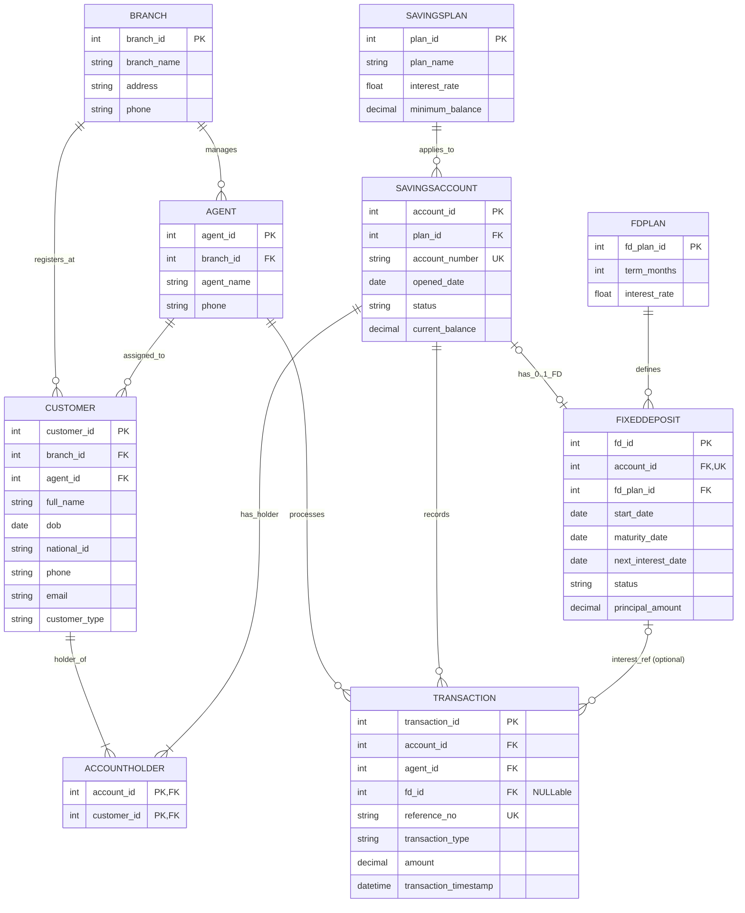

# Microbanking and Interest Management System — Entity Relationship Diagram (ERD)

## Overview
This document represents the database schema and Entity-Relationship model for the **Microbanking and Interest Management System (MIMS)** developed by **Group 31**. The model is normalized to Third Normal Form (3NF), ensuring strict data integrity, referential constraints, overdraft prevention, and ACID-compliant transaction tracking.

---

## Mermaid ER Diagram

---

## Entity Data Dictionary

### 1. BRANCH
Represents a physical banking branch operated by B-Trust.
* `branch_id` (`INT`, PRIMARY KEY, AUTO_INCREMENT): Unique identifier for each branch.
* `branch_name` (`VARCHAR(100)`, NOT NULL): Official name of the branch.
* `address` (`VARCHAR(255)`, NOT NULL): Physical location/address of the branch.
* `phone` (`VARCHAR(20)`, NOT NULL): Official branch contact telephone number.

### 2. AGENT
Represents a field banking agent assigned to a regional branch.
* `agent_id` (`INT`, PRIMARY KEY, AUTO_INCREMENT): Unique identifier for each banking agent.
* `branch_id` (`INT`, FOREIGN KEY -> `BRANCH.branch_id`): Branch to which the agent is assigned.
* `agent_name` (`VARCHAR(100)`, NOT NULL): Full name of the agent.
* `phone` (`VARCHAR(20)`, NOT NULL): Contact phone number of the agent.

### 3. CUSTOMER
Stores information about individual bank clients who register at a branch.
* `customer_id` (`INT`, PRIMARY KEY, AUTO_INCREMENT): Unique customer identifier.
* `branch_id` (`INT`, FOREIGN KEY -> `BRANCH.branch_id`): Registration branch.
* `agent_id` (`INT`, FOREIGN KEY -> `AGENT.agent_id`): Assigned primary service agent.
* `full_name` (`VARCHAR(150)`, NOT NULL): Legal customer name.
* `dob` (`DATE`, NOT NULL): Date of birth (used for savings plan age validation).
* `national_id` (`VARCHAR(20)`, NOT NULL, UNIQUE): NIC / Passport identification number.
* `phone` (`VARCHAR(20)`, NOT NULL): Primary telephone contact.
* `email` (`VARCHAR(100)`, NOT NULL): Customer email address.
* `customer_type` (`VARCHAR(20)`, NOT NULL): Entity classification (`Individual`, `Joint`).

### 4. ACCOUNTHOLDER (Junction / Bridge Entity)
Resolves the Many-to-Many relationship between Customers and Savings Accounts, supporting both individual and joint account structures.
* `account_id` (`INT`, PRIMARY KEY, FOREIGN KEY -> `SAVINGSACCOUNT.account_id`): Associated savings account.
* `customer_id` (`INT`, PRIMARY KEY, FOREIGN KEY -> `CUSTOMER.customer_id`): Customer registered as a holder.

### 5. SAVINGSPLAN
Defines the parameters for the five tiered savings accounts.
* `plan_id` (`INT`, PRIMARY KEY, AUTO_INCREMENT): Unique plan identifier.
* `plan_name` (`VARCHAR(50)`, NOT NULL): Tier name (`Children`, `Teen`, `Adult`, `Senior`, `Joint`).
* `interest_rate` (`DECIMAL(5,2)` / `FLOAT`, NOT NULL): Annual interest rate (e.g., `12.00` for 12%).
* `minimum_balance` (`DECIMAL(15,2)`, NOT NULL): Minimum threshold balance required (e.g., `0.00`, `500.00`, `1000.00`, `5000.00`).

### 6. SAVINGSACCOUNT
Core account ledger record for customer savings.
* `account_id` (`INT`, PRIMARY KEY, AUTO_INCREMENT): Internal surrogate key.
* `plan_id` (`INT`, FOREIGN KEY -> `SAVINGSPLAN.plan_id`): Applicable plan tier.
* `account_number` (`VARCHAR(20)`, UNIQUE, NOT NULL): Public bank account number.
* `opened_date` (`DATE`, NOT NULL): Date the account was established.
* `status` (`VARCHAR(20)`, NOT NULL): Status flag (`Active`, `Dormant`, `Closed`).
* `current_balance` (`DECIMAL(15,2)`, NOT NULL, DEFAULT `0.00`): Current monetary balance in LKR.

### 7. FDPLAN
Catalog of available fixed deposit tenures and predefined rates.
* `fd_plan_id` (`INT`, PRIMARY KEY, AUTO_INCREMENT): Unique FD product tier ID.
* `term_months` (`INT`, NOT NULL): Duration in months (`6`, `12`, `36`).
* `interest_rate` (`DECIMAL(5,2)` / `FLOAT`, NOT NULL): Annual interest rate (`13.00`, `14.00`, `15.00`).

### 8. FIXEDDEPOSIT
Represents a term commitment deposit linked to a savings account.
* `fd_id` (`INT`, PRIMARY KEY, AUTO_INCREMENT): Unique fixed deposit contract ID.
* `account_id` (`INT`, UNIQUE, FOREIGN KEY -> `SAVINGSACCOUNT.account_id`): Linked savings account receiving interest credits.
* `fd_plan_id` (`INT`, FOREIGN KEY -> `FDPLAN.fd_plan_id`): Selected FD tenure plan.
* `start_date` (`DATE`, NOT NULL): Effective contract start date.
* `maturity_date` (`DATE`, NOT NULL): Contract completion date.
* `next_interest_date` (`DATE`, NOT NULL): Date when the next monthly interest payout is scheduled.
* `status` (`VARCHAR(20)`, NOT NULL): Status (`Active`, `Matured`, `Terminated`).
* `principal_amount` (`DECIMAL(15,2)`, NOT NULL): Locked principal amount in LKR.

### 9. TRANSACTION
Immutable audit trail and operational log of all financial movements.
* `transaction_id` (`INT`, PRIMARY KEY, AUTO_INCREMENT): Unique ledger entry key.
* `account_id` (`INT`, FOREIGN KEY -> `SAVINGSACCOUNT.account_id`): Target savings account.
* `agent_id` (`INT`, FOREIGN KEY -> `AGENT.agent_id`): Processing agent ID (or system agent for automated runs).
* `fd_id` (`INT`, NULLABLE, FOREIGN KEY -> `FIXEDDEPOSIT.fd_id`): Optional reference to fixed deposit if the transaction is an interest credit.
* `reference_no` (`VARCHAR(30)`, UNIQUE, NOT NULL): Formatted transaction reference code (`TXN-YYYYMMDD-XXXXX`).
* `transaction_type` (`VARCHAR(20)`, NOT NULL): Type of operation (`DEPOSIT`, `WITHDRAWAL`, `INTEREST_CREDIT`).
* `amount` (`DECIMAL(15,2)`, NOT NULL): Monetary amount in LKR.
* `transaction_timestamp` (`DATETIME`, NOT NULL): Exact system timestamp of commitment.

---

## Relationship Rules & Constraints

1. **Branch & Agent Allocation:**
   - One `BRANCH` employs one or more `AGENT` records ($1:N$).
   - Each `AGENT` belongs to exactly one `BRANCH`.

2. **Customer Assignment:**
   - Each `CUSTOMER` registers at one `BRANCH` ($1:N$).
   - Each `CUSTOMER` is assigned to exactly one `AGENT` ($1:N$).

3. **Joint & Multi-Account Holdings:**
   - Modeled via `ACCOUNTHOLDER` ($M:N$).
   - A single customer can own or co-own multiple savings accounts.
   - Joint accounts are supported by having multiple customer records linked to the same `account_id`.

4. **Single Active FD per Savings Account:**
   - `FIXEDDEPOSIT.account_id` has a **`UNIQUE` constraint**, strictly enforcing that a savings account can be linked to at most **one** active Fixed Deposit ($1:0..1$).
   - Database triggers (`trg_CheckSingleFDConstraint`) additionally ensure that no new FD can be created if an active FD already exists for that account.

5. **FD Interest Payouts:**
   - Each interest credit transaction updates the linked `SAVINGSACCOUNT` balance and logs a corresponding `TRANSACTION` entry referencing the originating `fd_id`.
